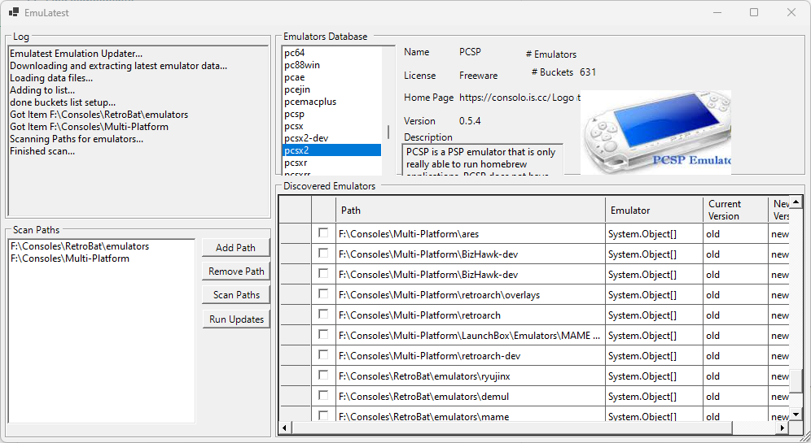

# EmuLatest

Searches through directories for known emulator executable files, lets you customize the results and update all found emulators to the latest version.  It supports over 300 emulators.

## How it works

* Emulators information comes from [detain/scoop-emulators](https://github.com/detain/scoop-emulators), which utilizes GitHub Actions to periodically check a set of urls using simple regexes and scripts to determine latest version and url information.
* PowerShell script using Windows.Forms for UI elements.
  * UI Designed in Visual Studio 2022 using the visual designer for a C# Form
  * PowerShell Module Convert-Form used to covnert the C# form to a PowerShell script
  * PS2EXE used to convert the PowerShell into an .Exe/Installer

## TODO

* [x] Design UI in VS C#
* [x] Convert to PS Form
* [x] Download and Extract Emulator data archive
* [x] Load emulator data
* [x] Get Directories from UI/User
* [x] Render emulators in UI
* [x] Scan Dirs for Matches
* [x] Get Bins
* [x] Display Matches
* [x] remove repo on close
* [x] fix database group element distribution/sizing
* [ ] fix logo display / scaling
* [ ] add check all button to discovered emulators
* [x] fix width on disco emulators sections
* [x] add saving/loading discovered/emulators and such
* [ ] change code around to avoid globals
* [ ] Ensure all bins are returned
* [ ] use caching so you dont reaload the data every time you click an emulator
* [x] better extractDir handling
* [ ] Upgrade Emulators
* [x] Auto-Resize Elements to match window size
* [ ] progress bar/status while scanning
* [ ] Auto Update
* [ ] GitHub Action setup
* [ ] Documentation
* [ ] Website

## Dev Links

* [PowerShell Multithreading: A Deep Dive](https://adamtheautomator.com/powershell-multithreading/#Runspaces_Kinda_Like_Jobs_but_Faster)
* [Sample scripts for system administration - PowerShell | Microsoft Learn](https://learn.microsoft.com/en-us/powershell/scripting/samples/sample-scripts-for-administration?view=powershell-7.2)

